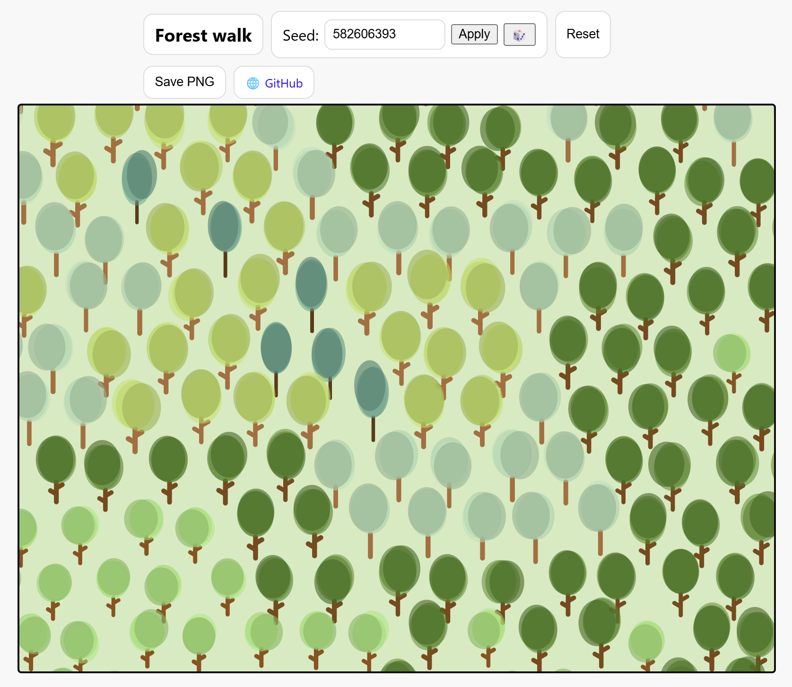

# Forest Walk

A generative art project using p5.js that simulates a walk through a procedurally generated forest. Each tree is created with unique DNA, resulting in a diverse and infinite landscape.

## Features
- Infinite forest scroll (pan and zoom)
- Random seed for reproducible forests
- Tree shapes, sizes, and colors generated procedurally
- Save the current view as a PNG
- Touch and mouse support (desktop and mobile)

## Usage
- Use the random seed button (🎲) to generate a new forest.
- Pan and zoom with mouse or touch gestures.
- Click "Save PNG" to export the current view.

## Development
- Built with [p5.js](https://p5js.org/)
- Main files: `main.js`, `forest.js`, `tree.js`, `DNA.js`, `rendering.js`

## License
MIT License

